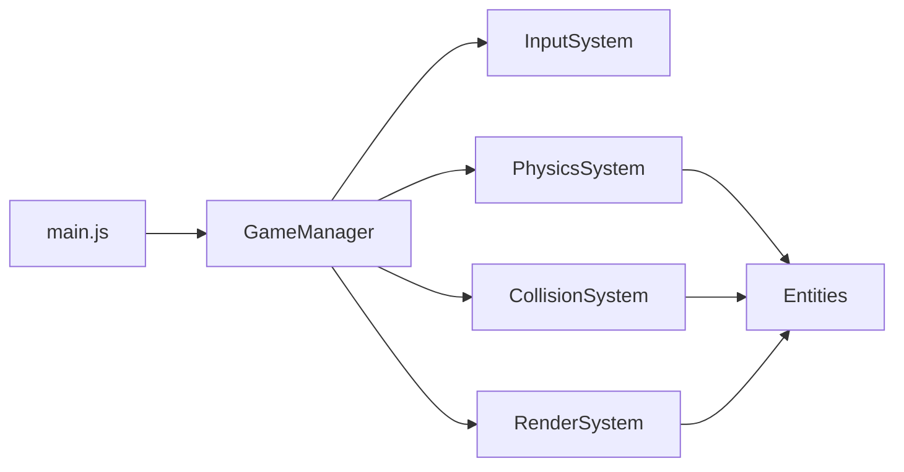

# 1.0- Developer Architecture Document

This document explains how the 2D Asteroids game is structured and how components interact.

## 1.1- Components
- **1.1.1- Main Loop**  
  - Initializes canvas, sets update/render timer.  
- **1.1.2- Entities**  
  - Ship, Asteroid, Bullet classes (in `src/entities/`).  
- **1.1.3- Systems**  
  - InputSystem (keyboard handling)  
  - PhysicsSystem (movement, wrap-around)  
  - CollisionSystem (collision detection and response)  
  - RenderSystem (drawing entities and UI)  
  - GameManager (game state, scoring, lives)
- **1.1.4- Utils**  
  - MathUtils, Constants, Helpers (in `src/utils/`)

## 1.2- File Structure
```
src/
├─ entities/
│  ├─ Ship.js
│  ├─ Asteroid.js
│  └─ Bullet.js
├─ systems/
│  ├─ InputSystem.js
│  ├─ PhysicsSystem.js
│  ├─ CollisionSystem.js
│  └─ RenderSystem.js
├─ GameManager.js
└─ main.js
```

## 1.3- Mermaid Diagram

**Legend:** G = Ship, Asteroid, Bullet

## 1.4- Execution Flow (Happy Path)
```
1. main.js loads -> init canvas and GameManager
2. GameManager.start() -> begin loop
3. Each tick:
   - InputSystem.process()
   - PhysicsSystem.update()
   - CollisionSystem.check()
   - RenderSystem.draw()
4. GameManager tracks score, lives, and end conditions
```

## 1.5- DoD Requirements
- All systems wired in main loop
- Entities update and render correctly
- Game state transitions work (start, play, game over)

---
